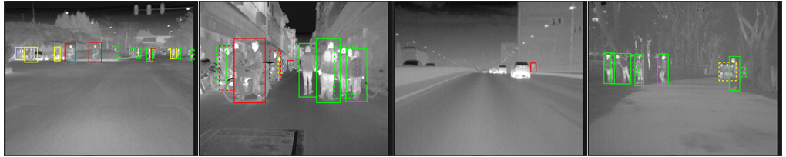

# SCUT FIR Pedestrian Dataset
A new benchmark dataset and baseline for on-road FIR pedestrian detection

### Description

The SCUT FIR Pedestrian Datasets is a large far infrared pedestrian detection dataset. It  consist of about 11 hours-long image sequences ($\sim 10^6​$ frames) at a rate of 25 Hz by driving through diverse traffic scenarios at a speed less than 80 km/h. The image sequences were collected from 11 road sections under 4 kinds of scenes including downtown, suburbs, expressway and campus in Guangzhou, China. We annotated 211,011 frames for a total number of 477,907 bounding boxes around 7,659 unique pedestrians.

### Citing SCUT FIR Pedestrian Dataset
If you find SCUT FIR Pedestrian Dataset useful in your research, please consider citing:
```
@article{xu2019,
author = {Xu, Zhewei and Zhuang, Jiajun and Liu, Qiong and Zhou, Jingkai and Peng, Shaowu},
title = {{Benchmarking a large-scale FIR dataset for on-road pedestrian detection}},
journal = {Infrared Physics {\&} Technology},
pages = {199--208},
volume = {96},
year = {2019}
doi = {https://doi.org/10.1016/j.infrared.2018.11.007},
issn = {1350-4495},
}
```

### Statistic of training and testing set

more details see [statistic.xlsx](https://github.com/SCUT-CV/SCUT_FIR_Pedestrian_Dataset/tree/master/dataset/statistic.xlsx).

#### Training Set

- S0-S10

| Label        | Frames with anno. | Bounding boxes | Occluded BB | Unique | Avg. frames per obj. |
| ------------ | ----------------- | -------------- | ----------- | ------ | -------------------- |
| walk person  | 48857             | 103239         | 31630       | 1613   | 64.00                |
| ride person  | 40519             | 71793          | 8697        | 807    | 88.96                |
| squat person | 1520              | 1608           | 324         | 22     | 73.09                |
| people       | 26385             | 38358          | 9805        | 612    | 62.68                |
| person?      | 13059             | 16820          | 6943        | 496    | 33.91                |
| people?      | 6855              | 8479           | 2457        | 153    | 55.42                |
| Summary      | 70517             | 240297         | 59856       | 3703   | 64.89                |

#### Testing Set

- S11-S20

| Label        | Frames with anno. | Bounding boxes | Occluded BB | Unique | Avg. frames per obj. |
| ------------ | ----------------- | -------------- | ----------- | ------ | -------------------- |
| walk person  | 43421             | 90526          | 26185       | 1523   | 59.44                |
| ride person  | 43153             | 86201          | 8689        | 1017   | 84.76                |
| squat person | 8010              | 837            | 184         | 14     | 59.79                |
| people       | 24098             | 33572          | 8903        | 647    | 51.89                |
| person?      | 17208             | 22483          | 8759        | 642    | 35.02                |
| people?      | 3399              | 3991           | 1604        | 97     | 41.14                |
| Summary      | 73115             | 237610         | 54324       | 3940   | 60.31                |


### Download

videos [GoogleDrive](https://drive.google.com/open?id=0B5mvevJ3ivDKbXdkVlNNSGJDVGM) [BaiduYun](http://pan.baidu.com/s/1geBkEMf)

annotations [GoogleDrive](https://drive.google.com/drive/folders/1rCZgCB1FwQNuXAzD7PWqKD8BjtwfSx0E?usp=sharing) [BaiduYun](https://pan.baidu.com/s/1B5-7uQ_UMLgXI84MIfw6jA) (open access)

### Tool

- [Github](https://github.com/SCUT-CV/SCUT_FIR_Pedestrian_Dataset)
- `Seq video format`. Data Format is compatible with Caltech Pedestrian Dataset Format
- [datatool](https://github.com/xzhewei/datatool).  Evaluation/labeling code for our dataset which is based on [Caltech Dataset](http://www.vision.caltech.edu/Image_Datasets/CaltechPedestrians/).
- [toolbox](https://github.com/xzhewei/toolbox/tree/scut). The `datatool` depended tool which is based on [Piotr's Matlab Toolbox](https://pdollar.github.io/toolbox/index.html).

### Benchmark Results

#### Algorithm List
The mertic is log-average miss rate over the range of [$10^{-4}$, $10^0$] FPPI. 

|                      | Reasonable All | Overall |
| -------------------- | -------------- | ------- |
| FRCN-modified        | 17.73          | 38.68   |
| RPN+BF               | 18.88          | 41.57   |
| MSCNN                | 19.21          | 58.02   |
| YOLOv3               | 32.54          | 58.09   |
| Faster R-CNN-vanilla | 36.78          | 66.32   |
| YOLOv2               | 47.96          | 69.44   |
| ACF-T+THOG           | 62.75          | 76.60   |

The range of [$10^{-2}$, $10^0$] FPPI which we used before, there are several detector have been evaluated.

|                      | Reasonable All | Overall |
| -------------------- | -------------- | ------- |
| RPN+BF               | 8.28           | 25.19   |
| TFRCN                | 9.98           | 32.32   |
| RPN (RPN+BF)         | 12.07          | 32.94   |
| Faster R-CNN-vanilla | 19.75          | 52.00   |
| RPN-vanilla          | 34.87          | 61.20   |
| ACF-T+THOG           | 43.70          | 62.11   |

#### ROC

- [**Reasonable All**](dataset/benchmark/scuttestRocReasonable.pdf)
- [**Reasonable Walk Person**](dataset/benchmark/scuttestRocReasonable-walk-person.pdf)
- [**Reasonable Ride Person**](dataset/benchmark/scuttestRocReasonable-ride-person.pdf)
- [**Scale=Near**](dataset/benchmark/scuttestRocScale=near.pdf)
- [**Scale=Medium**](dataset/benchmark/scuttestRocScale=Medium.pdf)
- [**Scale=far**](dataset/benchmark/scuttestRocScale=far.pdf)
- [**No Occlusion**](dataset/benchmark/scuttestRocOcc=none.pdf)
- [**Occlusion**](dataset/benchmark/scuttestRocOcc=partial.pdf)
- [**Overall**](dataset/benchmark/scuttestRocAll.pdf)

### Contact

Please contact Zhewei Xu [xzhewei at gmail.com] with questions.
